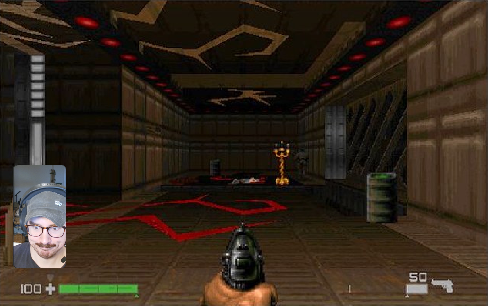
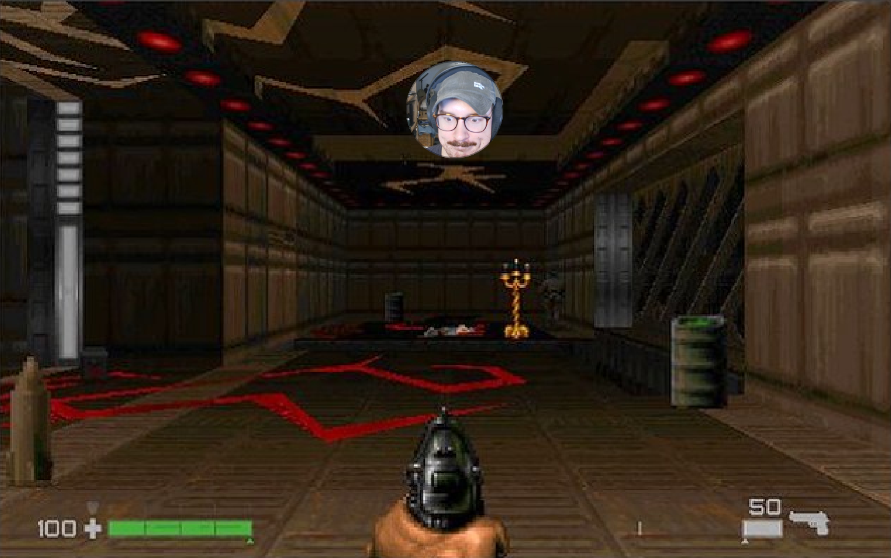
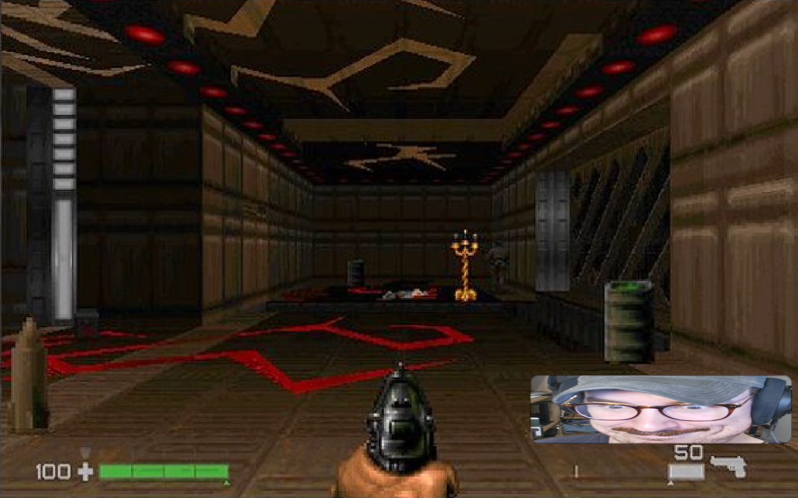
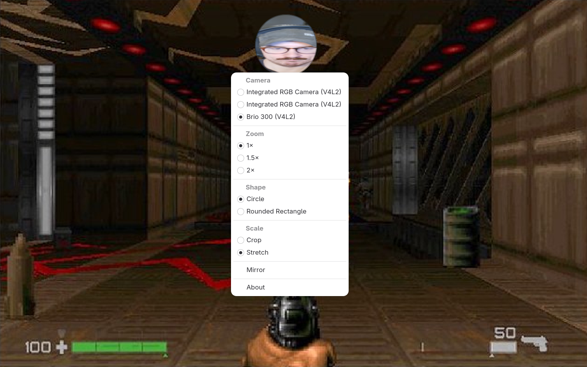

<h1 align="center">
  
  <br>
  GNOME Cam Overlay
</h1>

A minimal GNOME app that displays a webcam preview as a borderless overlay, for use during screen recording.

No recording — just a live preview with zoom, shape, and flip controls via right-click menu.

<table align="center">
  <tr>
    <td></td>
    <td></td>
  </tr>
  <tr>
    <td></td>
    <td></td>
  </tr>
</table>

## Features

- Live webcam preview (PipeWire)
- Circle or rounded rectangle shape clipping
- 1×, 1.5×, and 2× zoom
- Horizontal mirror/flip
- Double-click to expand to near-fullscreen
- Drag to move the window
- Settings persist across restarts

## Tips

- Use your compositor's window manager (e.g. `Super+Right Click` on GNOME) to set **Always on Top**
- Resize by dragging the window edges/corners

## Build

### Flatpak (recommended)

```sh
flatpak-builder --user --install --force-clean build io.github.didley.CamOverlay.yml
flatpak run io.github.didley.CamOverlay
```

### Local (meson)

```sh
meson setup build
ninja -C build
ninja -C build install
```

## Requirements

- GNOME Platform 49
- GStreamer with PipeWire support (`gst-plugins-pipewire`)
- Rust stable toolchain

## License

GPL-3.0-or-later
